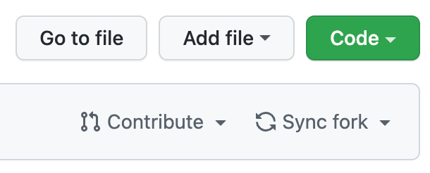
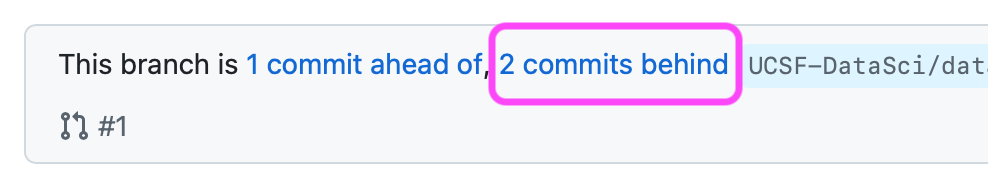
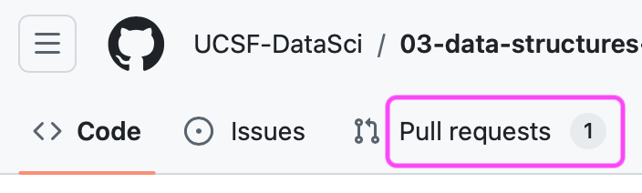

# Assignment

1. **Daily Quote Generator:** Select a random quote for the day and prints it. Optional: The same quote should be generated for a given day.

	Your task:
	1. Complete the get_quote_of_the_day() function
	2. Print the crontab that would run this script daily at 8:00 AM and append the output to a file

	Hint: Look up `random.choice()` to select a random item from a list. You can use the `date` module to get the current date and set a seed for the random number generator.
2. **Word Frequency Counter:** Read a text file (example code included) and count the frequency of each word, ignoring case.
	Usage: `python word_frequency.py <input_file>`  
	
	Your task: Complete the word_frequency() function to count word frequencies sorted alphabetically and limit to the first 20 words. Run the script on 'alice_in_wonderland.txt'.
	
	Hints:
	- Use a dictionary to store word frequencies
	- Consider using the `lower()` method to ignore case
	- The `split()` method can be useful for splitting text into words
	- Decompress Alice in Wonderland before running the script on it
3. **Maximum Product of 13 Adjacent Digits:** Find the thirteen adjacent digits in the 1000-digit number that have the greatest product. What is the value of this product?
	
	Your task: Complete the find_greatest_product() function to solve the problem.
	
	Hints:
	- You can iterate through the string using a for loop and string slicing
	- Keep track of the maximum product as you go through the loooong number
	- (Optional) Convert characters to integers using `int()`

```
73167176531330624919225119674426574742355349194934
96983520312774506326239578318016984801869478851843
85861560789112949495459501737958331952853208805511
12540698747158523863050715693290963295227443043557
66896648950445244523161731856403098711121722383113
62229893423380308135336276614282806444486645238749
30358907296290491560440772390713810515859307960866
70172427121883998797908792274921901699720888093776
65727333001053367881220235421809751254540594752243
52584907711670556013604839586446706324415722155397
53697817977846174064955149290862569321978468622482
83972241375657056057490261407972968652414535100474
82166370484403199890008895243450658541227588666881
16427171479924442928230863465674813919123162824586
17866458359124566529476545682848912883142607690042
24219022671055626321111109370544217506941658960408
07198403850962455444362981230987879927244284909188
84580156166097919133875499200524063689912560717606
05886116467109405077541002256983155200055935729725
71636269561882670428252483600823257530420752963450
```

# Hints & tips

## Assignment updates

I sometimes update assignments to make them clearer or remove unanticipated difficulties, so make sure your fork (copy) of the assignment stays up to date!

You can do this two ways:
1. Upon opening your fork of the repository, there may be a "Sync Fork" button. Click it and select "Fetch upstream".
	 
3. Merge in my "Pull Request" by clicking "X commits behind" or "Pull Requests". Then click through to merge in the changes.



## Getting `nano` as your $EDITOR

If `crontab -e` opens an editor you're not familiar with (likely `vim`), you can specify which editor to use with the $EDITOR environment variable.

A few ways to do this:
1. Persistently set the $EDITOR variable by walking through the slides at the beginning of [Lecture 04](https://ds217.badmath.org/04)
2. Set the variable for your current session using `export EDITOR=nano`
3. Set the variable just for the current command using `EDITOR=nano crontab -e`

## Codespaces don't have `crontab` installed

This one surprised me. Apparently GitHub doesn't expect you to keep Codespaces open long enough to use `cron` for automation. 

You can install `cron` and `crontab` using `apt`, the package manager for Debian and Ubuntu Linux:

`sudo apt update; sudo apt install cron`

This runs two commands in sequence separated by a semicolon:

- `sudo` runs whatever follows as the "Super User", allowing you to make changes like installing software outside your home directory or even breaking the operating system
- `apt update` tells the package manager to check for the latest versions of software available
- `apt install cron` tells the package manager to look for a package called cron and install it if available

## Catching most punctuation

Punctuation can give you trouble counting words; e.g., 'word', 'word.', and 'word?' counted separately. You can strip leading and trailing characters using the `strip()` method in python.

- `my_string.strip()` removes leading and trailing whitespace
- `my_string.strip('ga,') removes leading an trailing 'g', 'a', and ',' characters
- [string.punctuation](https://www.geeksforgeeks.org/string-punctuation-in-python/) is a constant that contains common punctuation marks (need to `import string` first)


